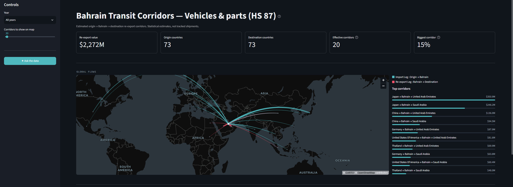
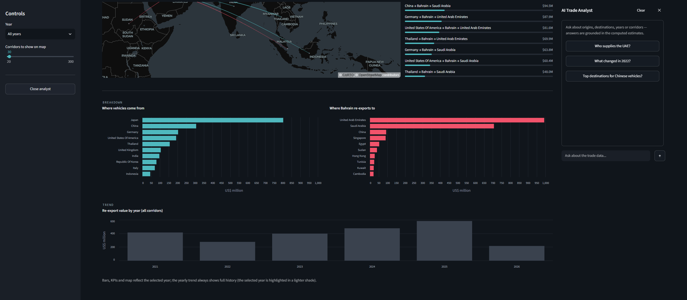

# Bahrain Transit Corridors — Vehicles & Parts (HS 87)

Estimating and mapping **origin → Bahrain → destination** re-export corridors for vehicles and parts, built from Bahrain's public customs data — with an AI analyst that answers questions grounded in the computed figures.

🔗 **Live app:** https://bahrain-transit-corridors.streamlit.app/


> ⚠️ **These corridors are statistical estimates, not tracked shipments.** Bahrain publishes imports and re-exports separately — it does *not* publish which import origin each re-export goes to. This project reconstructs the likely origin→destination links using a transparent allocation method (described below). Treat the numbers as directional estimates.





---

## What it does

Bahrain is a re-export hub: goods arrive from one country and are shipped onward to another. The official data shows *what comes in* and *what goes out*, but not *how they connect*. This dashboard estimates those connections for **HS chapter 87 (vehicles & parts)** and presents them as:

- an interactive **world flow map** (teal = import leg, red = re-export leg),
- **KPIs** (total re-export value, origins, destinations, concentration),
- **top-corridor** and **where-from / where-to** breakdowns,
- a **yearly trend**, and
- an **AI Trade Analyst** you can ask questions in plain English.

## Key findings

- The trade is dominated by an **East Asia → Gulf** pattern: vehicles from **Japan, China, Germany, the US** routed through Bahrain and re-exported mainly to the **UAE and Saudi Arabia**.
- It's **highly concentrated** — despite dozens of countries involved, it behaves like only **~20 effective corridors** (1 ÷ HHI), and the single largest corridor (Japan → Bahrain → UAE) is ~**15%** of all value.
- Re-exports **dipped in 2022** (~−33%), consistent with the global vehicle/semiconductor supply-chain disruption, then recovered.

## Method (how the estimates are built)

For each month, the total re-exports of HS 87 are **allocated across origin countries in proportion to each origin's share of Bahrain's vehicle imports** over a trailing 3-month window (a simple dwell-time lag, since goods sit before being re-exported). Monthly contributions are summed per origin→destination corridor.

The pipeline is reconciled and reports its own uncertainty:
- **re-export ÷ import ratio ≈ 0.42** (re-exports are less than half of imports — Bahrain keeps most imports for domestic use),
- **~84% of re-exports attributed** to an import basis (the rest predate the import data window).

## The AI Trade Analyst

The chat panel uses the **Anthropic API with tool use**: the model never invents numbers. It calls a parameterized `query_corridors` tool that runs real pandas queries against the computed estimates, then explains the results. Ask things like *"Who supplies the UAE?"*, *"What changed in 2022?"*, or *"Which corridor is most concentrated?"*.

> The AI layer **interprets** the computed metrics — it does not generate them.

## Data source

[Bahrain Open Data Portal (data.gov.bh)](https://www.data.gov.bh) — Foreign Trade: imports, re-exports, and national exports, HS chapter 87, 2021–2026.

## Tech stack

Python · pandas · Streamlit · pydeck (deck.gl) · Altair · Anthropic API

## Project structure

```
bahrain-corridors/
├─ app/app.py                 # Streamlit dashboard + AI panel
├─ src/
│  ├─ ingest.py               # download raw datasets
│  ├─ clean.py                # harmonise into tidy panels
│  ├─ corridors.py            # corridor engine (allocation, reconciliation)
│  ├─ hs_reference.py         # HS chapter labels
│  ├─ country_coords.py       # ISO2 → lat/lon for the map
│  ├─ ai_tools.py             # query_corridors data tool
│  └─ ai_chat.py              # Anthropic tool-use loop
├─ data/processed/            # shipped corridor outputs (parquet)
├─ notebooks/                 # exploratory analysis
├─ tests/                     # unit tests for the engine
├─ requirements.txt           # runtime deps
└─ requirements-dev.txt       # + pipeline / notebook / test deps
```

## Run locally

```bash
git clone https://github.com/IsaN2003/bahrain-transit-corridors.git
cd bahrain-transit-corridors

python -m venv .venv
.venv\Scripts\activate          # Windows  (use: source .venv/bin/activate on macOS/Linux)

pip install -r requirements.txt
streamlit run app/app.py
```

The processed corridor data ships with the repo, so the app runs immediately — no need to re-run the pipeline.

**For the AI analyst**, add a `.env` file in the project root:
```
ANTHROPIC_API_KEY=sk-ant-your-key
```
(The map and charts work without it; only the chat needs a key.)

### Reproduce the data pipeline (optional)

```bash
pip install -r requirements-dev.txt
python -m src.ingest      # download raw customs data
python -m src.clean       # build tidy panels
python -m src.corridors   # compute corridor estimates
```

## Limitations

- Corridors are **estimates**, not observed shipment-level trade. Accuracy depends on the assumption that re-exports mirror recent import shares.
- Covers **HS chapter 87 only** (vehicles & parts).
- Values are in **US$** as reported by the source data.

---

*Built as a data-science portfolio project.*